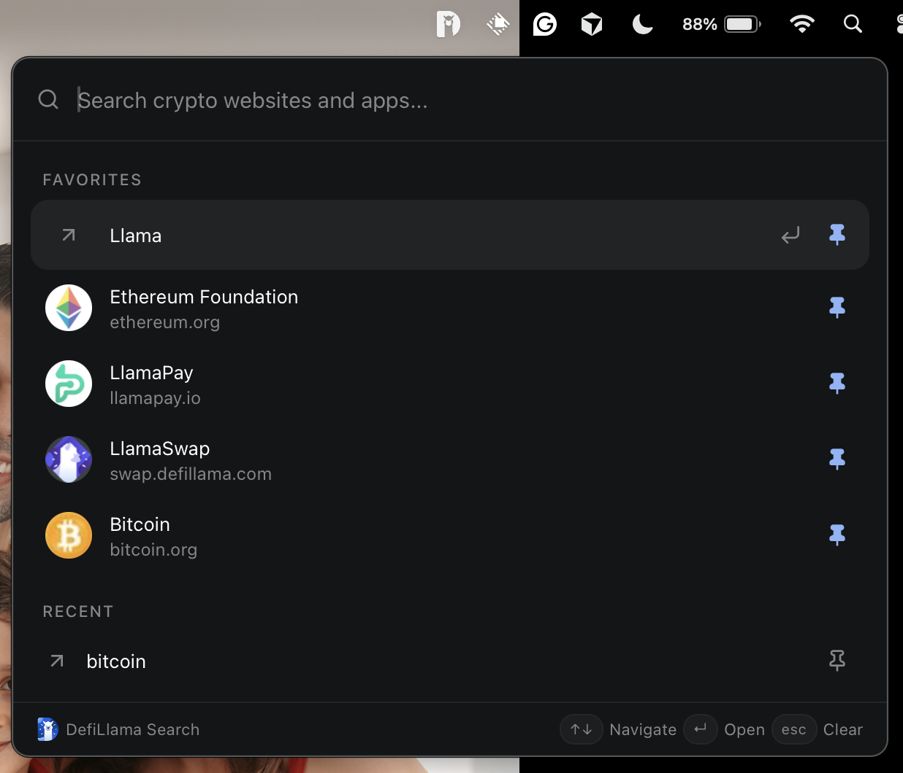
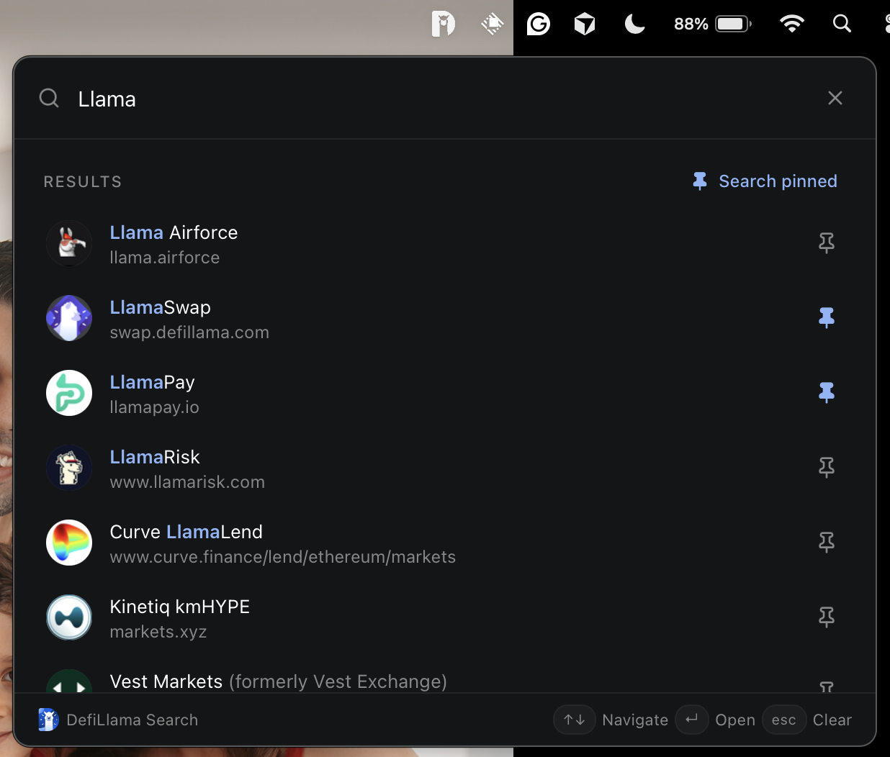

<p align="center">
    
</p>

<h1 align="center">
  Unofficial DefiLlama Search for macOS
</h1>
<p align="center">
  A tiny macOS menu bar app for fast, keyboard-first access to <a href="https://search.defillama.com">DefiLlama Search</a>.
</p>

<p align="center">
  <a href="#">
    
  </a>
</p>

This is an **independent open-source client**. It is not developed, maintained, or endorsed by DefiLlama.

Click the menu bar icon (or press `⌘⇧L`) to open a compact popover, type a query, and press Enter to open the official project link in your default browser.

<table>
  <tr>
    <td width="50%" align="center">
      
    </td>
    <td width="50%" align="center">
      
    </td>
  </tr>
</table>

## What it does

- Lives in the macOS menu bar with no Dock icon
- Opens a native popover anchored near the tray icon
- Searches the public DefiLlama Search directory
- Navigates results with `↑` / `↓`
- Opens the selected result in the default browser
- Remembers recent queries locally (up to 8)
- Pins search results and queries as favorites (up to 20), persisted in `localStorage`
- Shows **Favorites** above **Recent searches** when the field is empty
- Clears search history or favorites from the tray menu
- Opens an **About** window from the tray menu

## Tech stack

- [Tauri](https://tauri.app) 2 for the native macOS shell
- React + TypeScript + Vite for the UI
- Tailwind CSS + selected [shadcn/ui](https://ui.shadcn.com) primitives (`Command`, `Separator`)
- Isolated search client in `src/lib/search`
- Vitest for unit tests

## Requirements

- macOS 10.15+
- [pnpm](https://pnpm.io) 10
- Node.js 20+
- Rust 1.77.2+ (`rustup`)
- Xcode Command Line Tools

## Development

```bash
pnpm install
source "$HOME/.cargo/env"
pnpm tauri:dev
```

Rust must be on your `PATH`. If `cargo` is missing in an already-open terminal, run `source "$HOME/.cargo/env"` or open a new tab.

`pnpm dev` starts the Vite UI only. Use `pnpm tauri:dev` for the real menu bar app.

## Scripts

| Script        | Description                                     |
| ------------- | ----------------------------------------------- |
| `tauri:dev`   | Run the native menu bar app                     |
| `tauri:build` | Build the `.app` and `.dmg`                     |
| `dev`         | Vite UI only (no tray or popover)               |
| `build`       | Type-check and build the frontend               |
| `test`        | Run Vitest                                      |
| `typecheck`   | `tsc --noEmit`                                  |
| `lint`        | ESLint                                          |
| `format`      | Prettier                                        |
| `icons`       | Regenerate app and tray icons from the SVG/PNG  |
| `clean`       | Remove `dist`, `node_modules`, Rust `target`, … |
| `check:fix`   | Format, lint, type-check, and test              |

## Build the macOS app

```bash
pnpm tauri:build
```

The `.app` and `.dmg` land in `src-tauri/target/release/bundle/`.

## Release

Keep `package.json`, `src-tauri/tauri.conf.json`, and `src-tauri/Cargo.toml` on the same version, then push a tag:

```bash
git tag v0.1.0
git push origin v0.1.0
```

GitHub Actions builds a universal macOS DMG (Apple Silicon + Intel) and attaches it to the GitHub Release. The build is unsigned, so first launch is right-click the app → Open.

## Keyboard shortcuts

| Shortcut                  | Action                                              |
| ------------------------- | --------------------------------------------------- |
| `⌘⇧L`                     | Toggle the search popover                           |
| `↑` / `↓`                 | Move the selected row                               |
| `Enter`                   | Open the selected result, or restore a pinned query |
| `Escape`                  | Clear the search field (popover stays open)         |
| Click outside the popover | Hide the popover                                    |
| `⌘W` / `Escape`           | Close the About window                              |

The accelerator is defined once in `src-tauri/src/window.rs` (`TOGGLE_SHORTCUT`). During `tauri dev`, macOS may ask for Accessibility permission so the terminal can register `⌘⇧L`.

Pin buttons on result and recent rows do not trigger the row action. Left-click the tray icon to toggle the popover.

## Tray menu

Right-click the tray icon:

| Item                     | Action                                    |
| ------------------------ | ----------------------------------------- |
| `Open Search`            | Show the popover (`⌘⇧L`)                  |
| `Clear Favorites`        | Remove pinned items from `localStorage`   |
| `Clear Search History`   | Remove recent queries from `localStorage` |
| `About DefiLlama Search` | Open the About window                     |
| `Quit`                   | Exit the app (`⌘Q`)                       |

## License

This project is licensed under the MIT License - see the [LICENSE](./LICENSE) file for details.
